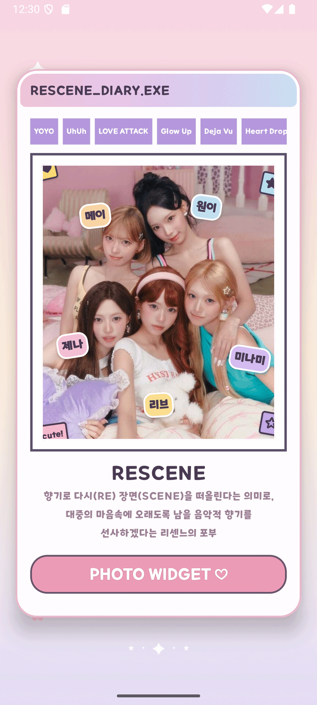

  <h1>📸 리센느 포토 위젯</h1>
  
<strong>향기로 다시(RE) 장면(SCENE)을 떠올리는 리센느의 순간을 홈 화면에 담다</strong>

  
  
  

리센느 멤버 사진을 선택하고, 원하는 사진을 Android 배경화면 또는 홈 화면 위젯으로 등록할 수 있는 팬 프로젝트입니다.

## ✨ 기능 시연

### 1. 리센느 다이어리 메인 화면

  

리센느의 곡명 칩과 멤버 스티커를 배치한 다이어리형 시작 화면입니다. `MainActivity`의 `RescenePhotoDiary`가 곡명 칩의 가로 스크롤, 폴라로이드 미리보기, 멤버 이름 스티커를 Compose로 구성합니다. **PHOTO WIDGET** 버튼을 누르면 멤버 사진 선택 화면으로 이동합니다.

### 2. 멤버 사진 랜덤 선택 및 포토 위젯 등록

  

`PhotoWidgetScreen`에서 원이·리브·메이·제나·미나미 프로필을 선택하면, `PhotoWidgetViewModel`이 해당 멤버의 이미지 목록을 불러온 뒤 한 장을 무작위로 표시합니다. 선택된 사진은 **위젯등록하기**를 통해 포토 위젯 등록 흐름으로 전달됩니다. 프로필 선택 상태와 이미지 로딩 상태를 분리해, 선택한 멤버와 현재 사진이 화면에 즉시 반영되도록 구현했습니다.

### 3. 배경화면 설정과 위젯 종류 선택

  

선택한 이미지는 `WallpaperDetailScreen`에서 Android의 배경화면 설정 화면으로 전달할 수 있습니다. 같은 사진으로 **사진 위젯**, **D-Day 위젯**, **시계 위젯**을 등록할 수도 있습니다. D-Day 위젯은 제목·날짜·표시 위치를 설정하고 남은 날짜를 계산하며, 시계 위젯은 표시 위치를 선택해 등록합니다. 위젯별 이미지 URL과 설정값은 `WidgetPreferences`에 저장되어 위젯 갱신 시 다시 사용됩니다.

## 🛠 기술 스택

| 구분 | 기술 |
| --- | --- |
| Language | Kotlin |
| UI | Jetpack Compose |
| Architecture | Hilt, ViewModel, Repository / UseCase |
| Async | Coroutines, Flow |
| Widget | GlanceAppWidget, GlanceAppWidgetReceiver |
| Image | Coil |
| Data | Supabase, SharedPreferences / DataStore |
| Security | ProGuard/R8 |

## 🔧 구현 포인트

- **랜덤 사진 선택:** 멤버를 선택할 때마다 해당 멤버의 원격 이미지 목록에서 무작위 사진을 표시합니다.
- **배경화면 연동:** 이미지를 캐시에 저장한 뒤 `FileProvider` URI와 `ACTION_SET_WALLPAPER` 인텐트로 시스템 배경화면 설정 화면을 엽니다.
- **위젯별 상태 저장:** 위젯 ID를 기준으로 사진 URL·위젯 유형·D-Day 설정·시계 위치를 저장합니다.
- **Glance 기반 위젯:** 포토·D-Day·시계 위젯을 `GlanceAppWidget`으로 구성하고, 저장된 상태를 읽어 각 위젯을 갱신합니다.

## ⚖️ 안내

본 프로젝트는 비상업적 팬 프로젝트입니다. 사용된 리센느 관련 이미지와 상표의 권리는 각 권리자에게 있으며, 권리자의 요청이 있을 경우 관련 콘텐츠를 조정하거나 비공개로 전환합니다.

## 🧑‍💻 Author

- Contact: [dkdkdodo123@gmail.com](mailto:dkdkdodo123@gmail.com)
- GitHub: [@cho123456789](https://github.com/cho123456789)
